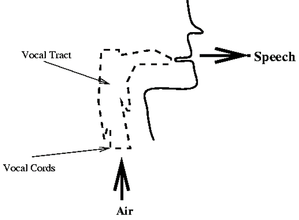
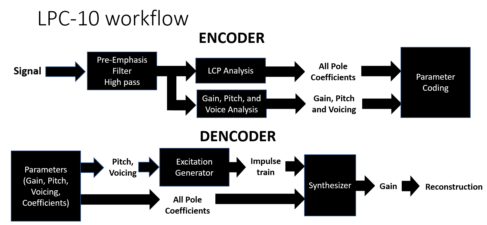
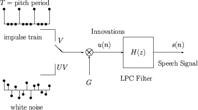
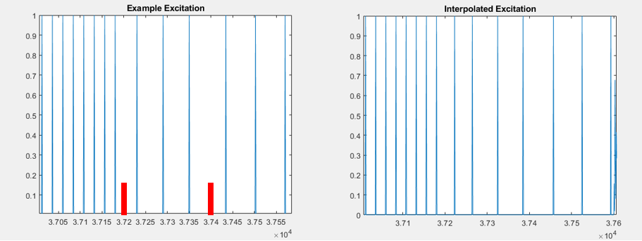

[![LinkedIn][linkedin-shield]][linkedin-url]


<!-- PROJECT LOGO -->
<br />
<p align="center">
  <a href="https://github.com/Karndeep-UCSD/Real-Time-LPC10-Vocoder-Implementation">
    
  </a>

  <h3 align="center">LPC10 Speech Encoder Implementation</h3>

  <p align="center">
    The goal of speech compression is to maximally compress the audio data without corrupting the words or voice of the speaker. In this work, I implement the LPC-10 codec as per Federal Standard 1015, first introduced in 1984. Input audio is compressed from a 8kHz sampling rate to a 2.4 kBits/s parameterized form. Both an encoder-decoder implementation and real-time implementation are provided. 
  </p>
</p>


<!-- TABLE OF CONTENTS -->
<details open="open">
  <summary>Table of Contents</summary>
  <ol>
    <li><a href="#project-overview">Project Overview</a></li>
    <li><a href="#data-availability">Data Availability</a></li>
    <li><a href="#usage">Usage</a></li>
    <li><a href="#results">Results</a></li>
    <li><a href="#contact">Contact</a></li>
  </ol>
</details>


<!-- PROJECT OVERVIEW -->
## Project Overview
<p align="center">
    
</p>

<p>
  LPC10 is based upon a physical model of speech synthesis in humans. For a given input signal, it is windowed into 25ms long windows. For each window, voicing, a fundemental frequency, gain, and coefficients for an all-pole filter are found. The physical model of speech assumes that at a small time scale, speech can be modeled by an linear time-invariant system. For this model, gain corresponds to air flow/volume, the fundemental frequency is the pitch of an individuals voice, and the vocal tract is modeled by a 10th order all-pole filter.
</p>

<p align="center">
    
</p>

<p>
  Once encoded and trasmitted, speech can be sythesized. A pulse train with a period of the individuals fundemental frequency is used to stimulate the estimated all-pole filter. The output signal is then scaled based on the gain. Unvoiced audio undergoes the same process, with randomized excitation(white noise) and a 4th order filter. 
</p>

<p align="center">
    
</p>

<p>
  Specific to this work, I attempted to improve the quality of the output audio by using linear interpolation of pitch and gain. For pitch interpolation, the pitch was modulated between each bin in a causal fashion. Modulation was only present in the first half of each window. Similarly, the phase of the excitation signal was tracked and corrected. An example of pitch and phase interpolation is shown above. Gain modulation was applied using a linearly-interpolated envelope. 
</p>
  


### Data Availability
<p>
  
  The vocoder was tested using audio clips from both genders. Neutral, angry, and sleepy audio clips were reconstructed to evaluate overall performance. Data can be downloaded from: [EmoV DataSet]( https://github.com/numediart/EmoV-DB). 
  
  
</p>

  
## Usage

1. Encoder-Decoder
  ```sh
  LPC_Encoder_Decoder.m
  ```
  This script takes in an audio clip, downsamples it to 8kHz, ecodes the audio, and sythesizes the audio back. Phase correction is included in this code. 
  
2. Encoder-Decoder with gain and pitch interpolation
  ```sh
  LPC_Encoder_Decoder_Interpolation.m
  ```
  This clip performs the same steps as the above code with the addition of interpolating both the gain and pitch. 
  
3. Real-Time Implementation
  ```sh
  LPC_RealTime.m
  ```
  This program allows for real-time listening of the sythesized audio. Phase correction is included. The order of the all-pole filter is maintained as a variable to demonstrate the varied audio quality that can be sythesized. 

## Results

  <p>
  
  A few representative examples are included in this repository [examples]( https://github.com/Karndeep-UCSD/Real-Time-LPC10-Vocoder-Implementationn/SampleOutputs). The original high quality audio is played followed by the synthesized audio.
  
  </p>


<!-- CONTACT -->
## Contact

Karndeep Singh Rai-Bhatti - [Linkedin]( https://linkedin.com/in/karndeep-raibhatti) - karndeep.raibhatti@gmail.com

Project Link: [https://github.com/Karndeep-UCSD/Real-Time-LPC10-Vocoder-Implementation](https://github.com/Karndeep-UCSD/Real-Time-LPC10-Vocoder-Implementationn)


<!-- MARKDOWN LINKS & IMAGES -->
[linkedin-shield]: https://img.shields.io/badge/-LinkedIn-black.svg?style=for-the-badge&logo=linkedin&colorB=555
[linkedin-url]: https://linkedin.com/in/karndeep-raibhatti
